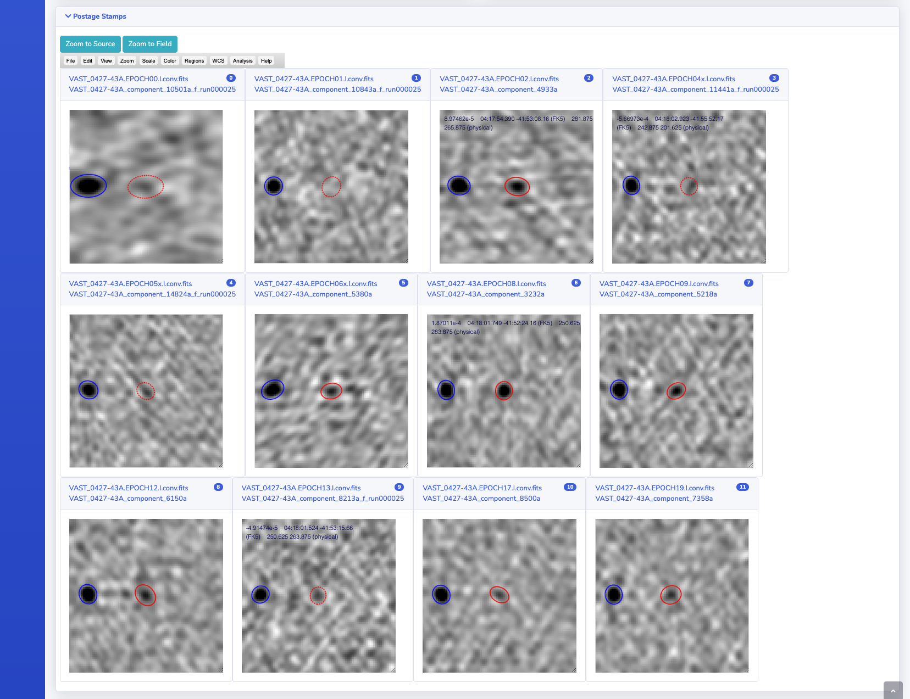
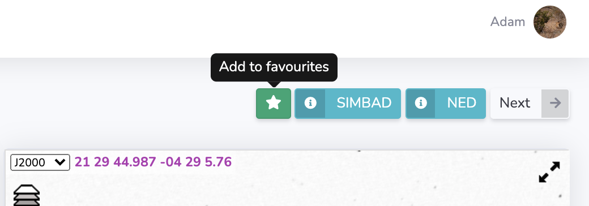
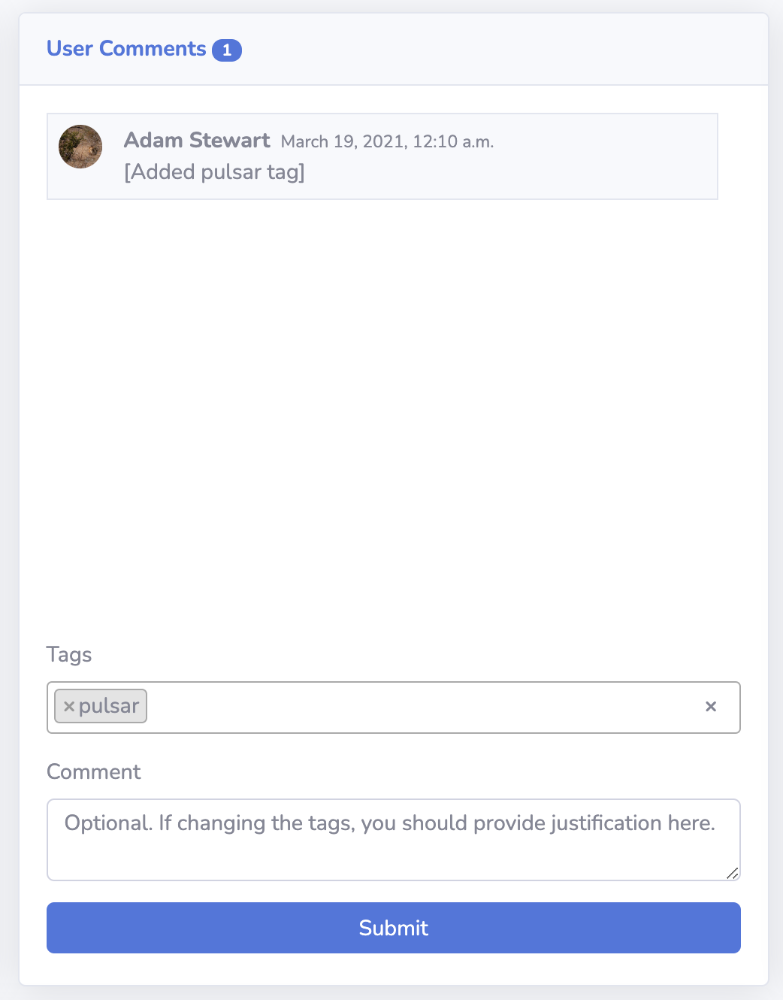

# Source Pages

This page details the website pages for information on the sources.

## Source Query

Users can filter and query the sources currently in the database by using the form located on this page. 

The form is submitted by clicking the blue 'magnifying glass' button, the red 'bin' button will reset the form by removing all entered values.
Once the form is submitted the results are dynamically updated in the results table below the form (i.e. on the same page).

The following sections provide further details on the form.

[{: loading=lazy }](../img/source-query-form.png)

### Data Source

Here a specific pipeline run can be selected from a dropdown list to filter sources to only those from the chosen run. By default sources from all runs are shown.

!!! note
    Only successfully completed pipeline runs are available to select. This rule also applies when `all` is selected.

### Cone Search

Users can choose whether to input their coordinates directly or use the object name resolver to attempt to fetch the coordinates.

#### Manual Input

The format of the coordinates should be in a standard format that is recongised by astropy, for example:

* `21 29 45.29 -04 29 11.9`
* `21:29:45.29 -04:29:11.9`
* `322.4387083 -4.4866389`

Galactic coordinates can also be entered by selecting `Galactic` from the dropdown menu that is set to `ICRS` by default. 
Feedback will be given immediately whether the coordinates are valid, as shown in the screenshots below:

[{: loading=lazy }](../img/cone-search-ok.png)
[{: loading=lazy }](../img/cone-search-bad.png)

Once the coordinates have been entered the radius value must also be specified as done in the screenshot above. Use the dropdown menu to set the radius unit to be `arcsec`, `arcmin` or `deg`.

#### Name Resolver

To use the name resolver, the name of the source should be entered into the `Object Name` field (e.g. `PSR J2129-04`), select the name resolver service and then click the `Resolve` button.
The coordinates will then be automatically filled on a successful match.

[{: loading=lazy }](../img/cone-search-resolve.png)

if no match is found then this will be communicated by the form as below:

[{: loading=lazy }](../img/cone-search-resolver-bad.png)

### Table Filters

This section of the form allows the user to place thresholds and selections on specific metrics of the sources. 
Please refer to the [Source Statistics page](../design/sourcestats.md) for details on the different metrics. There are also tooltips located on the form to offer explanations.

The following options are not standard source metrics:

#### Include and Exclude Tags

Users can attach tags to sources (see [Tags and Favourites](#tags-and-favourites)) and here tags can be selected to include or exclude in the source search.

#### Source Selection

Here specific sources can be searched for by entering the source names, or source database `id` values, in a comma-separated list. For example:

* `ASKAP_011816.05-730747.77,ASKAP_011816.05-730747.77,ASKAP_213221.21-040900.42`
* `1031,1280,52`

are valid entries to this search field. Use the dropdown menu to declare whether `name` (default) or `id` values are being searched.

### Results Table

Located directly below the form is the results table which is dynamically updated once the form is submitted.
The full detail page of a specific source can be accessed by clicking on the source name in the table. 
Explanation of the table options can be found on the overview page [here](websiteoverview.md#data-tables).

[{: loading=lazy }](../img/source-query-results.png)

## Source Detail Page

This page presents all the information about the selected source, including a light curve and cutouts of all the measurements that are associated to the source.

[{: loading=lazy }](../img/source-detail1.png)

### Star, SIMBAD, NED, Previous & Next Buttons

These buttons do the following:

* **Star**: Adds the source to the user's favourites, see [Tags and Favourites](#tags-and-favourites).
* **SIMBAD**: Performs a cone search on SIMBAD with a radius of 10 arcmin centered on the source location.
* **NED**: Performs a cone search on NED with a radius of 10 arcmin centered on the source location.
* **Previous**: Navigates to the previous source that was returned in the source query.
* **Next**: Navigates to the next source that was returned in the source query

### Details

A text representation of details of the measurement.

### User Comments & Tags

Users are able to read and post comments on a measurement using this form, in addition to adding and removing tags, see [Tags and Favourites](#tags-and-favourites).

### Aladin Lite Viewer

[Aladin Lite Documentation](https://aladin.u-strasbg.fr/AladinLite/doc/){ target=_blank }.

The central panel contains an Aladin Lite viewer, which by default displays the HIPS image from the [Rapid ASKAP Continuum Survey](https://research.csiro.au/racs/){ target=_blank }, centred on the location of the source.
Other surveys are available such as all epochs of the VAST Pilot Survey (including Stokes V) and other wavelength surveys such as 2MASS.

### Light Curve

The light curve of the source is shown. The peak or integrated flux can be selected by using the radio selection buttons.

[{: loading=lazy }](../img/source-detail2.png)

### Two-epoch Node Graph

The node graph is a visual representation of what two-epoch pairings have significant variability metric values. 
If an epoch pairing is significant then they are joined by a line on the graph. Hovering over the line will highlight the epoch pairing on the light curve plot.

### External Search Results Table

This table shows the result of a query to the SIMBAD and NED services for astronomical sources within 1 arcmin of the source location. 
Along with the name and coordinate of the matches, the on-sky separation between the source is shown along with the source type.

### JS9 Viewer Postage Stamps

[JS9 website](https://js9.si.edu){ target=_blank }.

The JS9 viewer is used to show the postage stamp FITS images of the measurements that are associated with the source, loaded from their respective image FITS files.

!!! note
    If the image data is removed from its location when the pipeline run was processed the JS9 viewer will no longer work.

[{: loading=lazy }](../img/source-detail3.png)

### Source Measurements Table

This table displays the measurements that are associated with the source. The detail page for the measurement can be reached by clicking the name of the respective measurement.

[{: loading=lazy }](../img/source-detail4.png)

### Related Sources Table

This table displays the sources that are a relation of the source in question. For further information refer to the [Relations](../design/association.md#relations) section in the association documentation.

## Tags and Favourites

Users are able to save a source as a favourite for later reference, in addition to adding `tags` to sources that can be used in source queries.

### Adding a Source to Favourites

A source can be added to a user's favourites by:

1. Selecting the 'star' button at the top of the source detail page as shown below.

    [{: loading=lazy width=600px }](../img/source-add-fav.png)
    
2. A modal window will open to confirm the saving of the source as a favourite. An optional comment can be entered.

    [{: loading=lazy }](../img/source-add-fav-modal.png)

3. Select `Add to Favourites` and a confirmation alert will be shown to signify the source has been added successfully.

    [{: loading=lazy width=600px }](../img/source-add-fav-confirm.png)

### Viewing Favourite Sources

A user can access their favourite sources by selecting the `Favourite Sources` option from the menu when clicking on their username at the top right-hand corner of the page.

[{: loading=lazy width=400px }](../img/source-user-fav.png)

The user will then be navigated to their favourite sources table as shown below.

[{: loading=lazy }](../img/user-fav-sources.png)

### Adding a Tag

Follow these steps to add a tag to a source:

1. Type the tag to be added into the field tag field. 
2. If the tag has already been used it will appear in the dropdown text options and can be selected by clicking the text. To add a new tag, enter the complete text of the new tag and again click the text in the dropdown text. 
3. After clicking the text the tag will then show as a bordered tag in the input field.
4. Finally, click the submit button (a comment is optional) and the tag will be saved as shown below. A comment will appear stating the addition of the tag.

[{: loading=lazy align=left width=350px }](../img/source-add-tag1.png)
[{: loading=lazy align=right width=350px }](../img/source-add-tag3.png)

### Removing a Tag

Click the `x` on the tag to remove it and then click the `Submit` button to save the removal.

[{: loading=lazy width=350px }](../img/source-tag-remove.png)
